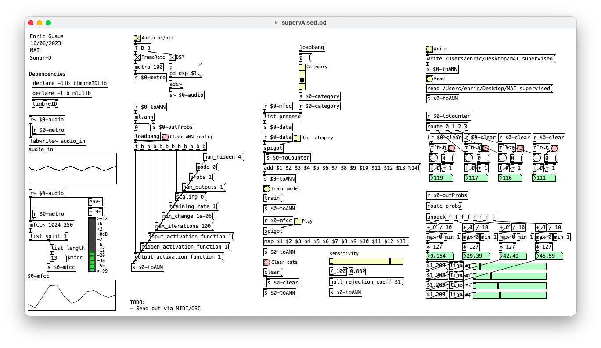

# supervAIsed

Pure Data patch for timbre based supervised audio classification on an Artificial Neural Network.

## Quick start guide

* Install [Pure Data](https://puredata.info/).
* Install [timbreID](https://github.com/wbrent/timbreIDLib) and [ml.lib](https://github.com/irllabs/ml-lib) externals.
* Set your audio device in the Preferences -> Audio menu.
* Edit and select your local path for read/write data and models at the upper-right corner of the patch (optional).
* Activate the "Audio on/off" toggle.
* Repeat 4 times:
  * select the i-th toggle in the "Category" selector.
  * start playing the i-th sound with specific timbre, and press the "Rec category" toggle.
  * keep playing until the sample i-th counter in the mid-right part of the patch is up to about 200 samples.
  * press again the "Rec category" toggle to stop recording
* Press the "Train model" button to train the model with recorded data
  * You can save this model by pressing the "Write" button at the upper-right corner of the patch (optional).
  * Tou can load a previous model by pressing the "Read" button at the upper-right corner of the patch (optional).
* Press the "Play" toggle to start classifying new data
  * Output probabilities (soft scaled between [0..1]) will be automatically mapped in a range [0..127].
  * Numeric values are shown in the green numeric boxes at the lower-right corner of the patch.
  * Visual value are shown in the green sliders at the lower-right corner of the patch.

## Dependencies

* [timbreID](https://github.com/wbrent/timbreIDLib): An audio analysis library for Pure Data.
* [ml.lib](https://github.com/irllabs/ml-lib): A library of machine learning externals for Max and Pure Data.

## TODO List

* Send out via MIDI/OSC.
