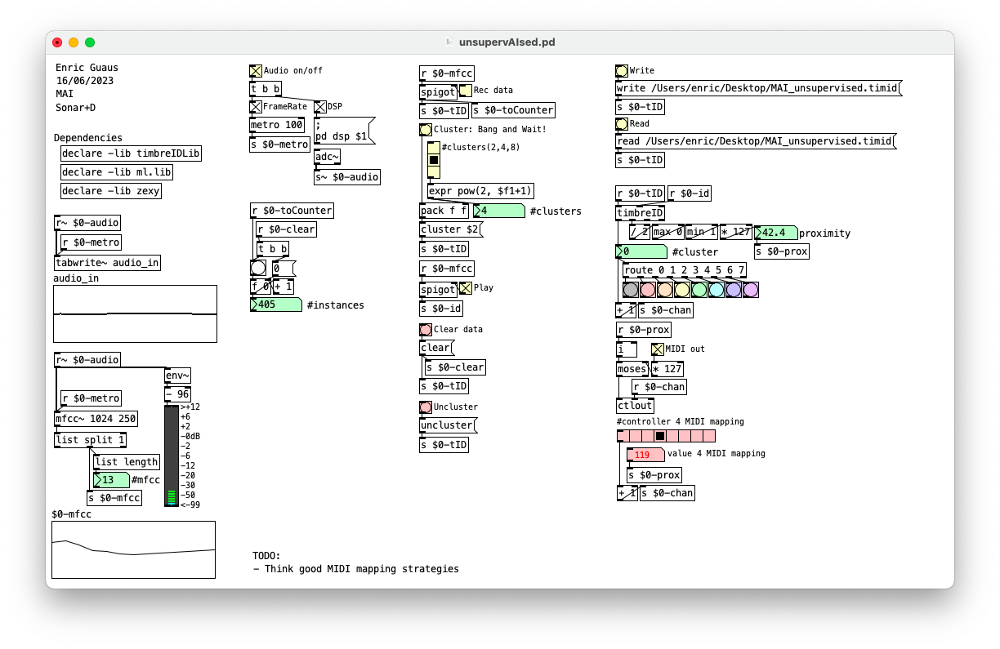

# unsupervAIsed

Pure Data patch for timbre based unsupervised audio classification using k-means with 2, 4 or 8 clusters.

## Quick start guide

* Install [Pure Data](https://puredata.info/).
* Install [timbreID](https://github.com/wbrent/timbreIDLib), [ml.lib](https://github.com/irllabs/ml-lib) and [zexy](https://git.iem.at/pd/zexy) externals.
* Set your audio device in the Preferences -> Audio menu.
* Edit and select your local path for read/write data and models at the upper-right corner of the patch (optional).
* Activate the "Audio on/off" toggle.
* Activate the "Rec data" toggle and start playing. Please, include all the desired timbres during the performance
* Select the "#clusters# (2,4,8) and push the "Cluster: Bang and Wait" bang.
* Wait for a while until Puredata responds again (please, be patient!)
  * You can save this model by pressing the "Write" button at the upper-right corner of the patch (optional).
  * You can load a previous model by pressing the "Read" button at the upper-right corner of the patch (optional).
* Press the "Play" toggle to start classifying new data
  * Output probabilities (soft scaled between [0..1]) will be automatically mapped in a range [0..127].
  * Numeric values are shown in the green numeric boxes at the mid-right corner of the patch (assigned cluster and proximity).
  * Clusters are visualized in the colorful buttons at the mid-right corner of the patch.
  * Press the "MIDI Out" toggle to start sending data
    * clusters are sent as midi controls [1..8]
    * proximity are sent as midi data [0..127]
 
 ## Connecting to external apps
 